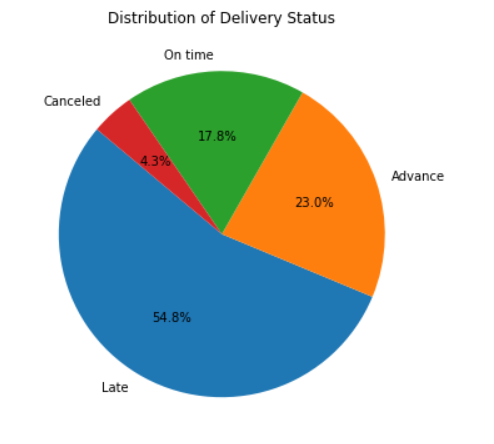
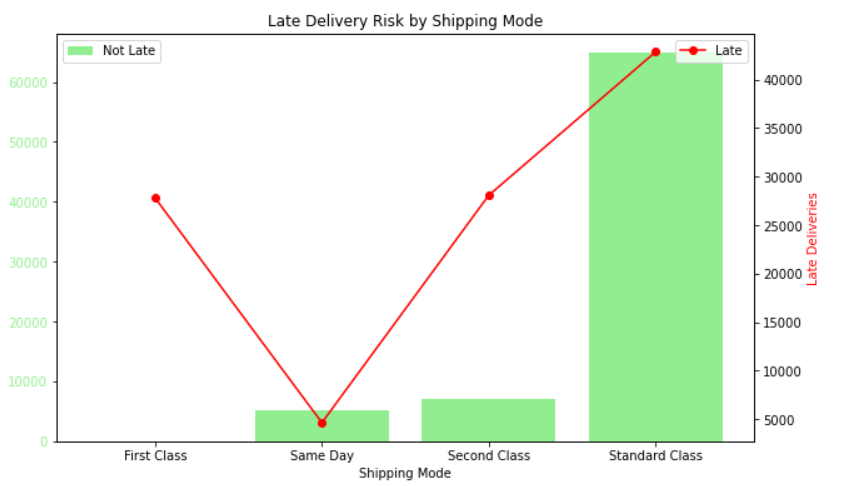
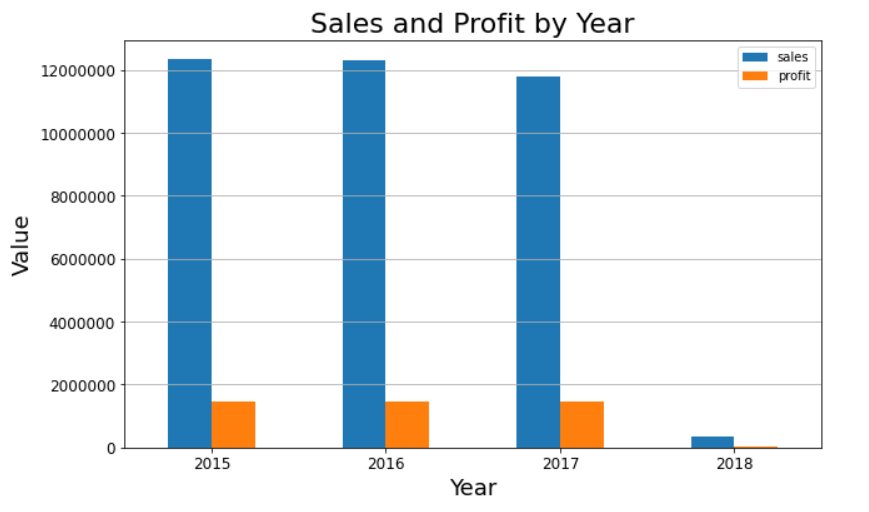

# Supply Chain & Inventory Management Analysis (Python)

**AnalytixLabs integrated case study · Oct 2023 · Python · pandas · Plotly · GeoPandas · statsmodels · Excel dashboard**

This was the Python capstone of my 2023 full-time data-analytics studies. It uses a global sports-and-outdoor retailer's supply-chain data: **180,519 order lines** and a **118-product inventory table** covering 2015 to early 2018. The goal was to find where deliveries fail, where stock and profit sit, and what to prioritise.

| | |
|---|---|
| 📓 **Notebook** | [`notebook/supply_chain_analysis.ipynb`](notebook/supply_chain_analysis.ipynb): data audit → preparation → 20+ analyses → charts → regression |
| 📊 **Dashboard** | [`dashboard/supply_chain_insight_dashboard.xlsx`](dashboard/supply_chain_insight_dashboard.xlsx): a one-page Excel dashboard of the 11 key charts |
| 🖥️ **Deck** | [`presentation/supply_chain_analysis.pptx`](presentation/supply_chain_analysis.pptx): 14-slide findings presentation |
| 🗜️ Original upload | `Python Integrated Case Study.zip` (same files, kept for history) |

---

## Headline numbers
| Metric | Value |
|---|---|
| Sales value | **$36.8M** |
| Units sold | 384,079 |
| Profit | **$3.97M** |
| Products · categories · customers | 118 · 51 · 20,652 |
| Orders flagged **late** | **57%** (103,400 of 180,519) |

## What I did
1. **Data audit:** split numeric and categorical columns, checked nulls and imputed the zipcode gaps.
2. **Data preparation:**
   - Built a **Late Delivery Risk** flag by comparing real with scheduled shipping days.
   - Renamed 46 columns to snake_case and fixed the data types.
   - Joined the inventory table onto the order lines.
3. **Analysis:**
   - Order and delivery status.
   - Late-delivery rate by week, month, quarter and year.
   - Units, sales and profit trends over time.
   - Inventory units and value by product class.
   - A stock re-order action per product.
   - Top products, categories and cities.
   - Payment types.
   - Shipping-mode reliability.
   - Most-discounted categories.
4. **Five extra analyses I chose:** customer segments vs sales and delivery risk, a **geospatial map** of orders, top destination countries by sales and profit, most expensive products, and department profitability.
5. **Visuals:** 11 charts, collected into an Excel dashboard and a presentation deck.
6. **Modelling:** an OLS regression of sales on product price and sales per customer, saved with `joblib`.

## Findings
- **Late delivery is structural, not seasonal.** The late rate stays at about 57% in every year (2015–2018), so the fix is in operations, not in peak-season staffing.
- **Shipping mode drives it.**
  - **First Class was late on every order** (27,814 of 27,814).
  - Second Class was on time only about 20% of the time, and Same Day about 52%.
  - **Standard Class was the most reliable, at about 60% on time.** The premium modes are promising speeds the network can't deliver.
- **Consumers are 52% of sales** ($19.1M), ahead of Corporate ($11.2M) and Home Office ($6.5M), and all three segments have the same late-delivery rate.
- **Top categories by sales** are Fishing, Cleats, Camping & Hiking, Cardio Equipment and Women's Apparel.
- **Top markets by profit** are the US, France, Mexico, Germany and Brazil.

---

## What I'd fix now (2026 review)
- **The regression leaks the answer.** `sales_per_customer` is almost the same number as `sales` (r = 0.99), so the R² of 0.98 isn't a real prediction. A useful model would predict **late delivery** (a classifier) from shipping mode, region and scheduled days, using only information known at order time.
- **"Most profitable categories" was ranked on sales**, not profit. The list should use `order_profit_per_order`.
- **The 2018 "collapse" is data coverage, not demand**, and the Q4 dip probably is too. 2018 has only 2,123 orders because the data stops early that year. Partial periods should be removed or labelled before showing any trend.
- **Re-order logic:** I used the average stock (168) as a single re-order point. The inventory table already has a per-product `reorder_point` and `safety_stock`, which I should have used.
- **Shipping reliability** should be shown as rates rather than counts; the counts only happen to point the same way.

*Dataset provided by AnalytixLabs for the case study (the DataCo supply-chain dataset); it isn't redistributed here.*

---
Part of my portfolio · **[ameer29.github.io](https://ameer29.github.io)** · more 2023 work: [Python case studies](https://github.com/ameer29/analytixlabs-python-case-studies) · [SQL + Excel + Power BI retail case](https://github.com/ameer29/retail-customer-analysis-sql-powerbi)
